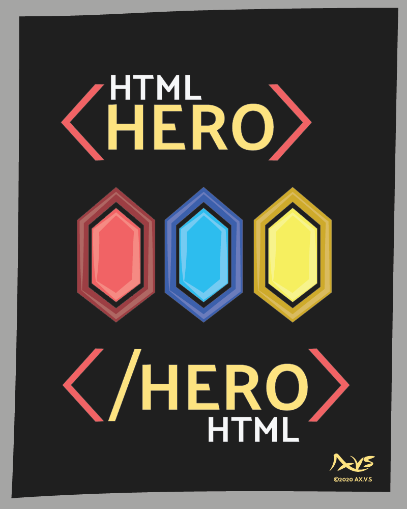

html_hero is an elegant html building tool designed to empower webdevelopment without invoking massive oppinonated frameworks. Through a build process it injects various types of components into html pages and templates into a final processed site.


# Features
## Component-Based Workflow
A component system which simplies handeling shared elements across multiple pages, and the components can easily be reused across multiple projects.

## Non-opinionated & Non-framework: 
You decide the output exactly, which is always in pure HTML. By how you structure the components you can get any output your project needs. You only need to use the tools that make sense and can plan your final output with full control.

## SSR-Friendly: 
Unlike massive front-end frameworks which implement their own server side code, with  html_hero you can use whatever SSR method you like and design your output html around this.

## Performance Optimization: 
Compared to front end frameworks html_hero can improve load times and SEO by having a majority of the html content pre-rendered. Only a static page is server unless you incorporate whatever SSR solutions you might need.

# Getting Started

### Installation

```
pip install html_hero
```

Quick Example
Here's a quick example of how to use html_hero to preprocess an HTML file with a reusable header component:

``` html
Create Your Component (components/header.html):
html
Copy code
<!-- components/header.html -->
<header>
    <nav>
        <!-- Navigation links -->
    </nav>
</header>
Use the Component in Your HTML (pages/index.html):
html
Copy code
<!-- pages/index.html -->
<!DOCTYPE html>
<html>
<head>
    <title>My Awesome Site</title>
</head>
<body>
    <!--HTML Hero Component Include: header-->
    {#include "header"#}
    <main>
        <!-- Main content -->
    </main>
</body>
</html>
```

### Preprocess Your HTML:

Run html_hero to preprocess your HTML files, inserting the header component into your index

# Copyright for Artwork and Branding Usage
The html_hero brand and associated graphics are copyrighted by AX.V.S ©2020. Please see the [Artwork and Branding Copyright](ARTWORK_AND_BRANDING.md) for details on how to correctly use the brand assets.

---

